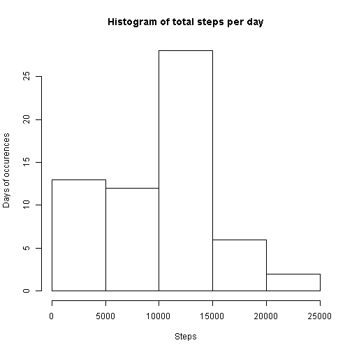

# Reproducible Research: Peer Assessment 1

As required for ease of evaluation, all the chunks in this R markdown document will use echo=TRUE, which is set globally as follows.

I have also suppressed messages and warnings that may appear when loading libraries.


```r
setwd("~/GitHub/RepData_PeerAssessment1")
library(knitr)
opts_chunk$set(echo = TRUE, warning = FALSE, message = FALSE)
```


## Loading and preprocessing the data

The data is inside a zip file, so I firstly need to unzip it before reading the csv file inside it.


```r
activity <- read.csv(unzip("activity.zip"))
```


Next I will convert the dates into R date format using the lubridate package, and interval into numeric.


```r
library(lubridate)
activity$date <- ymd(activity$date)
activity$interval <- as.numeric(activity$interval)
```


## What is mean total number of steps taken per day?

A histogram of the total number of steps is required here. Firstly, a summary of the data is created for each day, using the ddply function from plyr package. na.rm=TRUE is used to exclude NA data values.


```r
library(plyr)
byday.act <- ddply(activity, .(date), summarise, total.steps = sum(steps, na.rm = TRUE))
hist(byday.act$total.steps, main = "Histogram of total steps per day", xlab = "Steps", 
    ylab = "Days of occurences")
```

 


The mean and median total number of steps can similarly be calculated from "byday.act"" above.


```r
print(paste0("Mean: ", mean(byday.act$total.steps)))
```

```
## [1] "Mean: 9354.22950819672"
```

```r
print(paste0("Median: ", median(byday.act$total.steps)))
```

```
## [1] "Median: 10395"
```


## What is the average daily activity pattern?

To identify this, again we need to first reshape the data, now to summarise by the interval across all days, and calculating the average.


```r
byint.act <- ddply(activity, .(interval), summarise, average.steps = mean(steps, 
    na.rm = TRUE))
with(byint.act, plot(interval, average.steps, type = "l", main = "Average steps in each interval across all days", 
    xlab = "Interval", ylab = "Average number of steps"))
```

 


The 5-minute interval with the highest number of steps is visible from the chart, but we can clearly identify it below.


```r
print(paste0("Interval with the highest average steps is ", with(byint.act, 
    interval[which(average.steps == max(average.steps))])))
```

```
## [1] "Interval with the highest average steps is 835"
```


## Imputing missing values

First, to calculate the number of missing values for steps.


```r
missing <- which(is.na(activity$steps))
print(paste0("Number of missing values ", length(missing)))
```

```
## [1] "Number of missing values 2304"
```


Next to impute the missing values. I choose to use the average value for that particular time interval, which is already calculated as average steps for each interval in average daily activity pattern task above.

I use merge to obtain average steps for every entry in activity from the "byint.act" generated in task 3. The average steps is assigned to the steps value for all records missing the steps values as identified by the "missing" variable. This is updated to a new variable (as required by the assignment), which is a copy of the original "activity" variable.


```r
act.noNA <- activity
act.noNA$steps[missing] <- merge(activity, byint.act, by = "interval")$average.steps[missing]
```


Now we repeat steps in the second section to produce the histogram, mean, and median of the new dataset with imputed values.


```r
byday.act.noNA <- ddply(act.noNA, .(date), summarise, total.steps = sum(steps, 
    na.rm = TRUE))
hist(byday.act.noNA$total.steps, main = "Histogram of total steps per day", 
    sub = "(missing steps values imputed)", xlab = "Steps", ylab = "Days of occurences")
```

 

```r
print(paste0("Mean with imputed values: ", mean(byday.act.noNA$total.steps)))
```

```
## [1] "Mean with imputed values: 10889.7992576554"
```

```r
print(paste0("Median with imputed values: ", median(byday.act.noNA$total.steps)))
```

```
## [1] "Median with imputed values: 11015"
```


As can be seen, the histogram changed shape, where the bin with the fewest steps now become smaller, and redistributed to other bins which become taller (3rd-5th bins). Both the mean and median values have increased.

## Are there differences in activity patterns between weekdays and weekends?

To answer this, first I identify the day of the week for each record. A new variable called "weekpart" is created as a factor.  If the day of the week is either "Saturday" or "Sunday", "weekpart" will be assigned "weekend", otherwise it is "weekday".


```r
act.noNA$weekpart <- factor(ifelse(weekdays(act.noNA$date) %in% c("Saturday", 
    "Sunday"), "weekend", "weekday"))
```


After that, I extract the average steps similar to the approach in task 3 above, but now with average calculated for "interval" and "weekpart".


```r
byint.act.noNA <- ddply(act.noNA, .(interval, weekpart), summarise, average.steps = mean(steps, 
    na.rm = TRUE))
```


The result is plotted with facet on "weekpart" to separate weekday and weekend patterns. 


```r
library(ggplot2)
qplot(interval, average.steps, data = byint.act.noNA, geom = "line", main = "Average steps in each interval across all days", 
    sub = "(missing steps values imputed)", xlab = "Interval", ylab = "Number of steps", 
    facets = weekpart ~ .)
```

 

